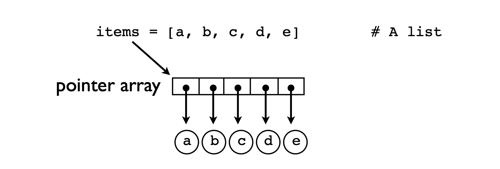

# Learnings
These are some notes and comments I've taken while going through the book. Many sentences here are copied verbatim from David's slides since I found them to be great summaries for different concepts.

- Exercise 2.1: Reading data as a single string vs. reading data with f.readlines() has a huge difference in memory consumption - 10 MB vs 40 MB for an example file. 
Point to ponder: what might be the source of that extra overhead?
    - > My guess is the additional information stored in a list data structure. 

- Memory efficiency:
    - Class with `__slots__` < Tuple < Namedtuple < Class < Dict

- A ChainMap class is provided for quickly linking a number of mappings so they can be treated as a single unit. It is often much faster than creating a new dictionary and running multiple update() calls.

- `zip(list1, list2)` Truncates to shortest input length

- Generators summarized in a line: Generators are useful in contexts where the result is an intermediate step

- You can directly pass in generators in function arguments:
    ```
    sum(x*x for x in nums)
    ```
- Generator expressions can save a LOT of memory. Key idea is that if you're dealing with map and reduce like operations on your data, you can chain operations on generator expressions and then actually materialize results one by one when you do a reduce op like sum(), max(), etc. See ex 2.3 for details - memory usage here goes from ~ 200 MB to ~ 120 KB.

- Use the `dis` library in python to peek into low level byte code. For example, use `dis.dis(f)` to get the byte code for a function `f`

- Builtin types operate according to
predefined "protocols" - the name for the special methods like `__add__` and `__len__`. Object protocols are baked into the interpreter as low-level bytecode 

- Container objects only hold references
(pointers) to their stored values. All operations involving the container internals only manipulate the pointers (not the objects)

    

- All "hashable" objects in python have a `__hash__()` and `__eq__()` method

- Assignment operations never make a copy of the value being assigned - all assignments are merely reference copies

- Immutable values can be safely shared, which can save a lot of memory (think a long list of dictionaries)

- `copy.deepcopy` is the only safe way to copy an object in python

## Classes 

- Object oriented programming is largely
concerned with the modeling of "behavior." 

- A class is a simply a set of functions that do different things on "instances"

- Classes do not define a scope. If want to operate on an instance, you always have to refer to it explicitly

- There are only three operations on an instance: 
```
obj.attr # Get an attribute
obj.attr = value # Set an attribute
del obj.attr # Delete an attribute - obj.attr no longer exists
```
- Method calls are layered onto the machinery used for simple attributes.
```
s.get_something # Looks up the method
s.get_something() # looks up and calls the method
```

- Internally, a method call `s.method()` is implemented as `s.method.__func__(s.method.__self__)`

- Class variables: can be accessed at the class level or by an instance. Can also be changed via inheritance.

- Class Method is a method that operates on the class itself. It's invoked on the class, not an instance. Example usecase is in providing alternate constructors. Most popular example of this is `AutoModel.from_pretrained` in 🤗Transformers.

- Implicit conversion of data in `__init__()` can limit flexibility and might introduce weird bugs if a user isn't paying careful attention.

## Python Encapsulation
- Python has programming conventions to indicate the intended use of something. Ex. private and public methods aren't exactly enforced like in C++.
- Attributes with a single underscore "_" are meant to act as private attributes (still accessible in instanecs and for subclasses)
- Attributes with a double underscore "__" have a special meaning - these are not accessible to subclasses. They are acessible in instance via Python's name mangling trick Ex:
```
s = MyClass()
s._MyClass__attr # to get __attr
```
- Properties in python: Useful alternative to accessor methods. Can also make sure a property is not stale/ computed when accessed. Note that a property is a _class variable_.
- Property decorators:
    - @property: to declare a property
    - @<\pname>.setter: function that's invoked with assignment ops. Needed to modify a property
    - @<\pname>.deleter: function that's invoked with deletion

- Advice on `__slots__`:  Do not use it except with classes that are simply going to serve as simple data
structures.

## Inheritance
- Inheritance in a nutshell: Extend existing code. That's it.
    - `__init__` inheritance: you must also initialize the parents with `super().__init__()`
    - objects defined via inheritance are a special version of the parent i.e same capabilities
    - `object` is a parent of all classes in Python 3 (even if not specified)
- Objects have two string representations:
    - str(obj) - printable output
    - repr(obj) - for programmers
    - The convention for `__repr__` is to return a string that, when fed to `eval()` , will recreate the underlying object.
    - print(obj) uses `__str__`
- Item access: `__setitem__`, `__getitem__`, `__delitem__`, `__contains__`, `__len__`

- Instances under the hood:
    ```
    d = Date.__new__(Date, 2012, 12, 21)
    d.__init__(2012, 12, 21)
    ```
- `__del__` : destructor method. Called when the reference count reaches 0. It's not the same as the del operator.`del` decreases ref count by 1

- Weak Reference: A reference to an object that does not increase its reference count

- Context managers: To be used with resources! That's it.
`__enter__()` and `__exit__()`

- Handler classes:  Code will implement a general purpose algorithm, but will defer certain steps to a separately supplied handler object (like the formatter implemented in 3.5)

## Advanced Inheritance and Mixins 
- _Inheritance is a tool for code reuse_

- _Python uses "cooperative multiple inheritance"_

- If you have a class `Child(A, B)`, then the common methods of A and B can get "merged" when accessed via a Child instance! 
    - `super()` moves to the next class in the list of parents

- **Mixin Classes:** A mixin is a class whose purpose is to add extra functionality to other class definitions. For example, the creator of a library can provide a set of classes. Mixins are a collection of add-on classes that can be provided to make those classes behave in different ways.

## Inside Python Objects
- Dictionaries are used for critical parts of the interpreter and may be the most important type of data in Python.
- Each instance gets its own private dictionary: `obj.__dict__`
- "...the entire object system is mostly
just an extra layer that's put on top of
dictionaries.."
- The instance dictionary (`__dict__`) holds data unique to
each instance whereas the class dictionary (`__class__`)
holds data collectively shared by all instances
- When you read an attribute, the attribute might be sitting in a local instance dictionary or the class dictionary: both might be checked (local first, then class)
- class dictionary : access via instance - `obj.__class__` or directly via class `cls.__dict__`
- A class is just a dictionary
- With inheritance, the inheritance chain is precomputed and stored in an "MRO" (Method Resolution Object) attribute on the class - `cls.__mro__`
- `super()` delegates to the next class on the MRO
- ` super()` might not go to the
immediate parent. It's different from doing `parent_cls.attr`
- Designing for inheritance:

    1. Rule 1: Compatible Method Arguments
    2. Rule 2: Method chains must terminate
    3. Rule 3: use `super()` everywhere
        - If multiple inheritance is used, a direct parent call will probably violate the MRO
- Attribute binding: An extra processing step while accessible attributes of classes.
    - When an attribute `cls.attr` is accessed on a class, the attribute is checked to see if it holds a _descriptor_ object. 
    - A descriptor is just an object with get, set and delete methods
    -  Every major feature of classes is implemented using descriptors
    - Functions/Methods are descriptors where `__get__()` creates the bound method object
    - Descriptors are one of Python's most powerful customizations (you own the dot) - you get low level control over the dot and can use it to do amazing things.
- Attribute Access: 
    - When you do `obj.x` -> first, `obj.__getattribute__(x)` is called. This looks for descriptors, checks the instance dictionary, checks bases classes (inheritance), etc.
    If still not found, it will invoke `obj.__getattr__(x)`

## Functions

- Basic design principle: Make functions "self-contained". Avoid hidden side effects. Only operate on passed arguments. Two goals: Simplicity and Predictability. 
- Prefer keyword arguments while passing optional arguments! 
    - Can also force it with * : `read_data(filename, *, debug=False)`
- Don't use mutable values as defaults! Default values are created only once for the whole program.
- Argument Transforms: Design for flexibility
- Doc Strings: feeds the `help()` command and dev tools
- Type Hints: Useful for code checkers, documentation, etc.
- **Return Type**: Have the function cleanly return one result. Just make it a tuple if you really need to

### Concurrency and Futures
- Functions can execute concurrently in separate threads. They'll have a shared state, with execution in a single interpreter. Recall lessons from your Operating Systems course: a thread is a single sequential path of execution in a program.
- Futures: Represents a future result to be computed. 

### Functional Programming
- Callback function: A function passed into another function as an argument, invoked as an action/routine inside the other function.
- Lambda functions: anonymous functions created on the spot
- Lambdas can be used to alter function args similar to `functools.partial`
### Closures
-  If an inner function is returned as a result, the inner function is known as a "closure".
- Variables used are accesssible via the `__closure__` special method
- Only variables that are needed are kept
- Closure variables are also mutable! Can be used to keep mutable internal state
- Applications:
    - Alternate evaluation (e.g., delayed evaluation)
    - Callback functions- what we saw before
    - Code creation ("macros")
### Exception Handling
- What exceptions to handle? Well, when recovery is possible
- Never catch all exceptions
- Wrapping an Exception:
    - `raise TaskError('It failed') from e`
- Don't use return codes!
- Use `AttributeError` when trying to say that an attribute shouldn't be set/ accessed.

## Testing
- Testing rocks, debugging sucks: Python is dynamic, interpreted - there's no compiler to catch your bugs
- Assertions/ Contracts: Assertions are runtime checks. Asserts are meant for program invariants, not to validate user inputs!
    - Can disable via `-O`: `python -O main.py`
### unittest module
- First, create a separate file for testing. Then define test classes like `TestMyFunc(unittest.TestCase)` (note that they must inherit from TestCase). 
- Define testing methods - check method should start with `test`
- Each test uses special assertions like `assertTrue`, `assertFalse`
- To run the test, just add `unittest.main()` in the main block. Can now run with `python`!

## Working with Code
### Advanced function usage
- Some simple stuff first: 
    - `func(*args)` accepts any number of arguments
    - function that accepts any keyword arguments: `func(x, **kwargs)` => extra keywords get passed in a dict
    - function that accepts any arguments: `func(*args, **kwargs)` `args` captures positional, `kwargs` captures keyword
### Scoping rules
- All statements have 2 scopes/ access to two scopes: The global scope of the module in which it is in, and the local scope, the scope private to the function it is in
- Global variables can be accessed within a function, but it cannot be modified without an explicit `global` keyword. This is important: Globals are already readable! Only before you modify them, you need to specify this keyword
- `globals()`/`locals()`: Gives you a dictionary with the contents of the global/local scope respectively
- Scope of the built-ins: The built-ins like `abs()`, `repr()` are in a special module called `builtins`. You can even modify it here (but is ill-advised)
- Frame Hacking: You can move up the stack frame with `sys._getframe()`. For example, to use the local variables of the caller inside a function, you can do `sys._getframe(1).f_locals`

### Function Objects
- Functions are also objects in python. You can pass them around, assign them to variables, and also inspect attributes. 
- Docstring: The first line of a function can be a string. Inspect via `func.__doc__`
- Type hints/ annotations: Inspect via `func.__annotations__`. Of course, as we are all painfully aware, type annotations do absolutely nothing in Python.
- You can also just add random attributes to a function! Stored in `func.__dict__`.
- More helpful attributes: `func.__defaults__`, `func.__code__.co_argcount`, `func.__code__.co_varnames`
- `inspect` module in python: enables more structured inspection.